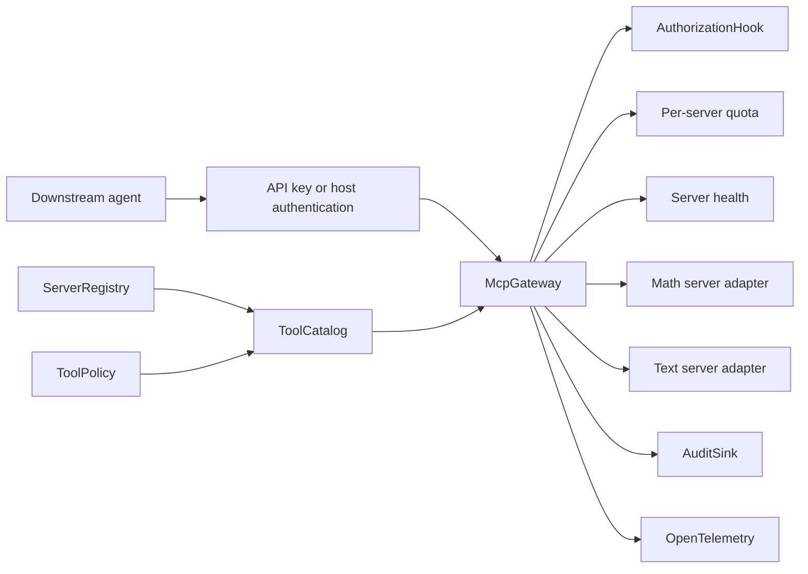
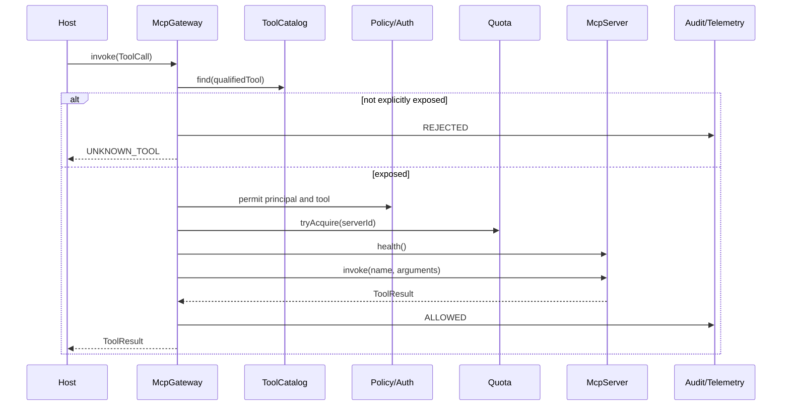

# Java MCP Gateway

Java MCP Gateway is an embeddable control plane for discovering and routing tools across multiple Model Context Protocol server adapters. It presents a namespaced, explicitly approved catalog and rejects unauthorized, denied, unhealthy, or over-quota calls before invoking an upstream server.

## Problem Statement

Applications that consume several MCP servers need consistent discovery, naming, authorization, quotas, health decisions, audit events, and telemetry. Connecting an agent directly to every discovered tool makes the agent responsible for security and operational policy and can accidentally expose administrative capabilities.

## What This Project Solves

The gateway provides:

- a concurrent MCP server registry and health contract
- deterministic, namespaced tool discovery
- an explicit allow-list with deny overrides
- principal-aware authorization hooks
- per-server fixed-window quotas
- local API-key authentication
- sanitized upstream failures
- audit outcomes for allowed, rejected, and failed calls
- OpenTelemetry spans without recording arguments or results
- transport-free local MCP servers for development and integration tests

Unknown and prohibited tools are absent from the public catalog. Discovery alone never grants access.

## When To Use It

Use this library when one Java process needs to expose a controlled catalog over multiple local or remotely adapted MCP servers. It fits agent runtimes, internal tool brokers, and desktop or service-side MCP installations.

Keep server-specific transport, credential acquisition, and JSON-RPC framing in an `McpServer` adapter. The policy and routing core remains transport independent and requires no hosted MCP service.

## Architecture / HLD



The host authenticates credentials and constructs a `ToolCall` with the resulting principal. `McpGateway` then enforces catalog membership, policy, authorization, quota, and health in that order before forwarding.

## Detailed Design / LLD



`ToolCatalog.refresh()` builds a replacement snapshot from registered servers. A tool enters that snapshot only if `ToolPolicy` permits its fully qualified name. Server IDs are the namespace, so `math.add` and `finance.add` cannot collide.

## Public API / API Structure

| Type | Responsibility |
| --- | --- |
| `McpServer` | Adapter contract for discovery, invocation, and health |
| `ServerRegistry` | Thread-safe registration and lookup |
| `ToolCatalog` | Policy-filtered discovery snapshot |
| `ToolPolicy` | Explicit allow set with deny precedence |
| `McpGateway` | Ordered pre-forward checks and routing |
| `AuthorizationHook` | Application-specific principal decision |
| `Quota` / `FixedWindowQuota` | Per-server admission control |
| `ApiKeyAuthenticator` | Constant-time local key matching |
| `AuditSink` / `AuditEvent` | Structured call outcomes |
| `GatewayTelemetry` | Call-span lifecycle abstraction |
| `OpenTelemetryGatewayTelemetry` | OpenTelemetry implementation |
| `LocalMcpServer` | In-process server with named tool handlers |

## Core Concepts

### Explicit exposure

An empty allow set exposes nothing. Deny rules override allow rules. Refreshing discovery does not weaken policy, and a denied handler is not invoked.

### Qualified names

Every descriptor binds a server ID and a local tool name. The gateway routes `server.tool`; it rejects descriptors whose advertised server ID does not match their registered server.

### Ordered controls

Catalog membership and authorization run before quota, health, telemetry, and forwarding. This prevents prohibited calls from consuming upstream capacity or creating an upstream side effect.

### Failure boundaries

Gateway errors use stable codes. Upstream exception messages are not returned because they can contain credentials, query fragments, or customer data.

## Local Prerequisites

- JDK 21 or newer
- Git
- network access for the first Maven dependency resolution

The Maven Wrapper pins Maven 3.9.12, so a global Maven installation is not required.

## Steps To Run

```bash
git clone https://github.com/aniket-deshkar/java-mcp-gateway.git
cd java-mcp-gateway
./mvnw verify
```

On Windows, use `mvnw.cmd verify`.

## Configuration

The core uses constructor configuration rather than global properties:

- register each unique `McpServer` in `ServerRegistry`
- provide exact qualified names to `ToolPolicy`
- implement `AuthorizationHook` for tenant, role, or ownership rules
- choose `Quota.unlimited()` or `FixedWindowQuota`
- connect an `AuditSink` and `GatewayTelemetry`
- supply a `Clock`, which makes quota and audit behavior deterministic in tests

Keep API keys outside source control. Load them from the host's secret provider and pass the resolved map to `ApiKeyAuthenticator`.

## Usage Examples

```java
ServerRegistry registry = new ServerRegistry();
registry.register(new LocalMcpServer(
    "math",
    Map.of("add", new LocalMcpServer.Tool(
        "Add two integers",
        Map.of("type", "object"),
        args -> ToolResult.success(Map.of(
            "value", (int) args.get("left") + (int) args.get("right"))))),
    () -> ServerHealth.UP));

ToolPolicy policy = new ToolPolicy(Set.of("math.add"), Set.of());
ToolCatalog catalog = new ToolCatalog(registry, policy);
catalog.refresh();

McpGateway gateway = new McpGateway(
    registry,
    catalog,
    policy,
    (principal, tool) -> principal.equals("agent-service"),
    new FixedWindowQuota(100, Duration.ofMinutes(1), Clock.systemUTC()),
    event -> System.out.println(event.outcome()),
    GatewayTelemetry.noOp(),
    Clock.systemUTC());

ToolResult result = gateway.invoke(new ToolCall(
    "request-42",
    "agent-service",
    "math.add",
    Map.of("left", 2, "right", 3)));
```

For stdio, HTTP, or SSE MCP connectivity, implement `McpServer` and translate its three operations to the target server's MCP transport.

## Testing

Run the complete quality gate:

```bash
./mvnw verify
```

The suite includes 14 deterministic unit and integration tests covering two-server discovery, namespaced routing, denied tools, authorization order, quota exhaustion and reset, unhealthy servers, sanitized failures, telemetry, API keys, invalid configuration, and registry/catalog invariants. Spotless and PMD run during `verify`.

GitHub Actions repeats the build on Java 21 without credentials or paid services.

## Observability

`AuditEvent` records time, request ID, principal, qualified tool, and outcome. It deliberately omits arguments and results. `OpenTelemetryGatewayTelemetry` emits `mcp.tool.call` spans with low-cardinality server and tool attributes and records upstream exceptions on failed spans.

Audit sinks should be bounded and failure-isolated in production so a logging outage cannot silently change routing semantics.

## Security

- no discovered tool is exposed without an exact allow rule
- deny rules take precedence
- authorization executes before forwarding
- API keys are compared with `MessageDigest.isEqual`
- upstream failure details are not propagated
- tool arguments and results are excluded from built-in telemetry and audit events

The host must authenticate before creating a `ToolCall`, validate tool arguments against the descriptor schema, use TLS for remote transports, rotate credentials, and bound request payloads.

See [SECURITY.md](SECURITY.md) for vulnerability reporting.

## Repository Structure

```text
src/main/java/.../mcpgateway/   Registry, catalog, controls, routing, telemetry
src/test/java/.../mcpgateway/   Unit and multi-server integration tests
.github/workflows/ci.yml        Java 21 quality gate
.mvn/wrapper/                   Pinned Maven Wrapper
pom.xml                         Build, dependencies, lint, and static analysis
```

## Design Decisions / Trade-offs

- The core is embeddable and transport independent. This keeps policy testable but requires a small adapter for each MCP transport.
- Catalog exposure is exact-name allow-listing. It favors reviewability over wildcard convenience.
- The included fixed-window quota is deterministic and local. Distributed deployments should provide a shared `Quota` implementation.
- Registration is additive and rejects duplicate IDs. Controlled replacement can be implemented by constructing and swapping a new registry.
- Telemetry avoids payload capture by design; applications needing content diagnostics should add separately governed, redacted instrumentation.

## Contributing

Read [CONTRIBUTING.md](CONTRIBUTING.md), create a focused branch, add deterministic tests, and run `./mvnw verify` before opening a pull request.

## License

Licensed under the Apache License 2.0. See [LICENSE](LICENSE).
